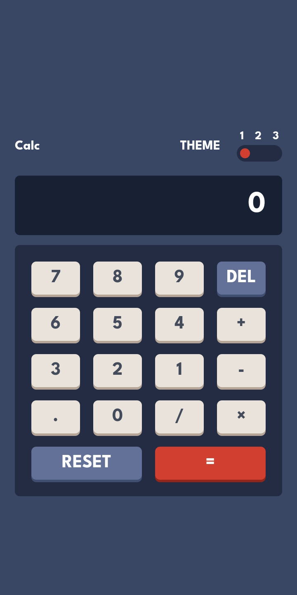
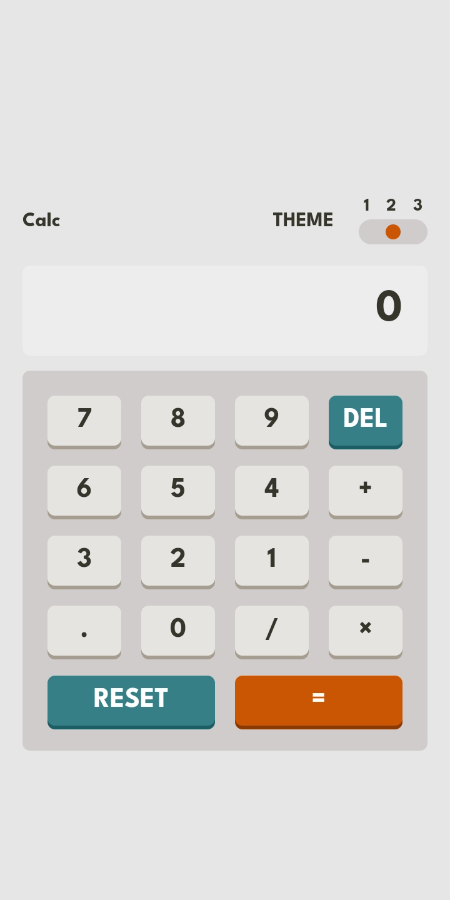
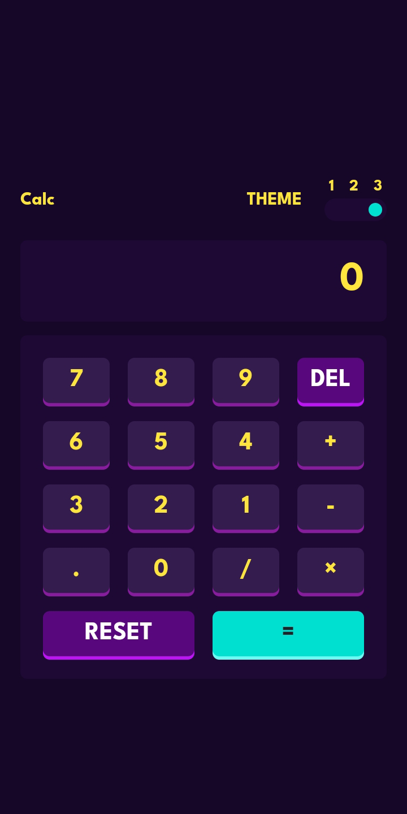

# Frontend Mentor - Calculator app solution

This is a solution to the [Calculator app challenge on Frontend Mentor](https://www.frontendmentor.io/challenges/calculator-app-9lteq5N29). Frontend Mentor challenges help you improve your coding skills by building realistic projects. 

## Table of contents

- [Overview](#overview)
  - [The challenge](#the-challenge)
  - [Screenshot](#screenshot)
  - [Links](#links)
- [My process](#my-process)
  - [Built with](#built-with)
  - [Useful resources](#useful-resources)
- [Author](#author)
- [Acknowledgments](#acknowledgments)

## Overview

### The challenge

Users should be able to:

- See the size of the elements adjust based on their device's screen size
- Perform mathmatical operations like addition, subtraction, multiplication, and division
- Adjust the color theme based on their preference
- **Bonus**: Have their initial theme preference checked using `prefers-color-scheme` and have any additional changes saved in the browser

### Screenshot

### Links

- Solution URL: [Github](https://github.com/dahmide/calculator-app-main-challenge)
- Live Site URL: [Vercel](https://calculator-dahmide-frontendmentor.vercel.app)

## My process

### Built with

- Semantic HTML5 markup
- CSS custom properties
- Flexbox
- CSS Grid
- Mobile-first workflow
- [React](https://reactjs.org/) - JS library
- [Tailwind CSS](https://tailwindcss.com) - For styles

### Useful resources

- [Intl.NumberFormat Documentation](https://developer.mozilla.org/en-US/docs/Web/JavaScript/Reference/Global_Objects/Intl/NumberFormat) - This resource helped me understand how to format numbers in my calculator app, ensuring clear and consistent outputs across different locales. I plan to reference it for future projects.

## Author

- Frontend Mentor - [@dahmide](https://www.frontendmentor.io/profile/dahmide)

## Acknowledgments

Thanks to [Frontend Mentor](https://www.frontendmentor.io) for the [calculator-app](https://www.frontendmentor.io/challenges/calculator-app-9lteq5N29) challenge.